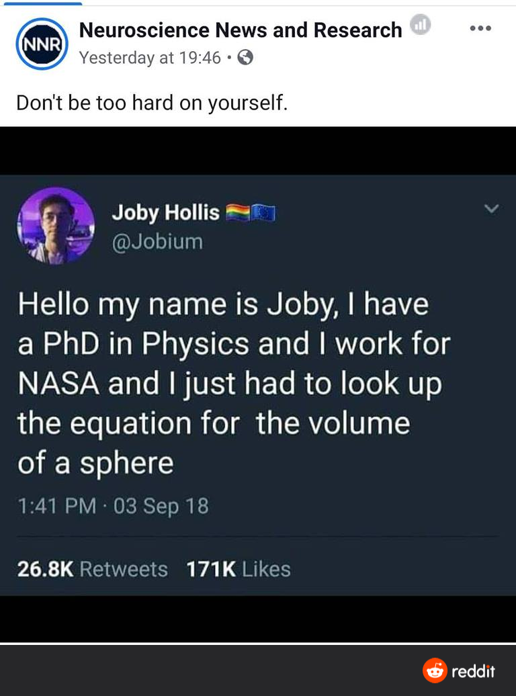

17SEP21
> "How inappropriate to call this planet "Earth," when it is clearly 'Ocean.'"  - Arthur C. Clarke

20SEP21
>The simple graph has brought more information to the data analyst’s mind than any other device.” — John Tukey

21SEP21
>"I have stared long enough at the glowing flat rectangles of computer screens. Let us give more time for doing things in the real world . . . plant a plant, walk the dogs, read a real book, go to the opera."  - Edwards Tufte

Maggie - Steal Like an Artist Austin Klyon

Ten things nobody told you about being creative:
"Art that only comes from the head isn't any good."

Coding / data science *is* a creative enterprise. Ideas and inspiration often come while working on other things. Maintaining balance makes us better, not a problem from not soding all the time. Balance is essential.

22SEP21
> "A program is a building of thought.", - Marjn Haverbeke 

From Ryan. If the blinking cursor is making you want to write code, slow down - plan it out - paper / whiteboard

23SEP21
> "Some lessons you learn gradually and some you learn in a sudden moment, like a flash going off incd a dark room.” ―John Darnielle

Don't get frustratd when things don't seem like they are coming as quickly as you would like.

27SEP21
>"It's tough to make predictions, especially about the future." - Yogi Berra

28SEP21
> "A human must turn information into intelligence or knowledge. We've tended to forget that no computer will ever ask a new question" - Grace Hopper Ravinder. 

Maggie: throwing program, fuction, or machine learning algorithm at every problem - you're on the track to having a job that will be automated. Using human intellegence and thinking can't be automated. That's your job security.
 
29SEP21
> “ ‘When someone seeks,’ said Siddhartha, ‘then it easily happens that his eyes see only the thing that he seeks, and he is able to find nothing, to take in nothing. [...] Seeking means: having a goal. But finding means: being free, being open, having no goal.’” -Hermann Hesse

Often assumed that numbers are cold, hard, objective truth. In data science and with statistical tools can see what we are looking for - either benignly or maliciously - must maintain perspective and strive to avoid bias in analysis.

30SEP21
>"Don't misuse statistics the way a drunk person misuses a lamp-post -- for support rather than for illumination" - Zach Guide

01OCT21
>"Research is formalized curiosity it is poking and prying with purpose." - Zora Hyeston

Easy to get lost in the woods when exploring data. Must go in with pointed questions. Science - should be reprodicuble.

Cabin at the end of the world - horror novel per madeline
Their eyes were watching god

04OCT21
>"All models are wrong, but some are useful."- George Box

Not reality. Approximation of some reality out there. Varying quality.

05OCT21
>"Nature is much simpler than all our thoughts about it." -Richard Feynman

06OCT21
>"The test of a first-rate intelligence is the ability to hold two opposed ideas in the mind at the same time, and still retain the ability to function. One should, for example, be able to see that things are hopeless and yet be determined to make them otherwise." - F. Scott Fitzgerald

Maggie. 

07OCT21
>"You might not make it to the top, but if you are doing what you love, there is much more happiness there than being rich or famous."-Tony Hawk

08OCT21
>"Not only is the Universe stranger than we think, it is stranger than we can think." -Werner Heisenberg

Keep in mind when looking at datasets and the world. Expect to be surprised. Keep a free slate free of assumptions and bias. 

12OCT21
>"Practicing sewing/designing clothes? If all you have is expensive cloth, you'll never want to cut and learn to sew. No one learns to drive in a Ferrari on a mountain road." - Kathleen Dollard (Microsoft)

Learn on something you are willing to destroy. Mistakes are inevitable - learn on something where the stakes are low. Learn to sew on scraps.

13OCT21
> REMINDER: Boot Camp | Full-immersion | Career Accelerator
- Not going to be comfortable
- Will Feel like moving too fast
- Feel like you dont have the foundation
- **Trust the process**
- Continue to movce forward
- Things will click

14OCT21
>"You just listen to your gut, okay? And on your way down to your gut, check in with your heart. Between those two things, they'll let you know what's what. They make good harmony, like two" - Ted Lasso

15OCT21
>“There are two possible outcomes: if the result confirms the hypothesis, then you've made a measurement. If the result is contrary to the hypothesis, then you've made a discovery” 
― Enrico Fermi

Most of the aha moments come when things go contrary to our expectations.

> 18OCT21
""There is no such thing as a failed experiment, only experiments with unexpected outcomes" - Buckminster Fuller

> 19OCT21
"The process of doing a second draft is the process of making it look like you knew what you were doing all along." -Neil Gaiman

> 20OCT21
"We know very little, and yet it is astonishing that we know so much, and still more astonishing that so little knowledge can give us so much power."
Bertrand Russell

>22OCT21
“I've missed more than 9000 shots in my career. I've lost almost 300 games. 26 times, I've been trusted to take the game winning shot and missed. I've failed over and over and over again in my life. And that is why I succeed.” 
― Michael Jordan

>25OCT21

>26OCT21
""There is no better than adversity. Every defeat, every heartbreak, every loss, contains its own seed, its own lesson on how to improve your performance the next time." - Malcolm X

>27OCT21
"Scuking at something is the first step to be kind of good at something"
Path to mastery is a series of failures

>28OCT21:
Reviewing meeting with codeup grads - soft skills: problem solving and documentation key

>01NOV21:
Happy Diwali from Ravinder to all

>02NOV21:
"Master your instrument, master the music, and then  forget all that bullshit and just play" - Charlie Parker