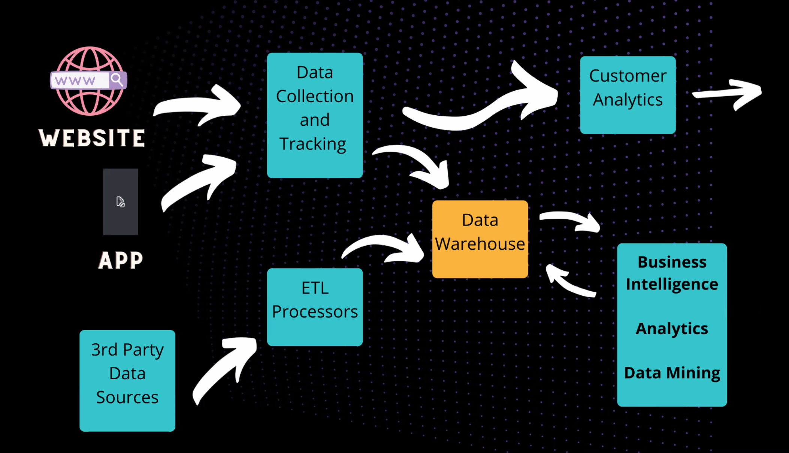
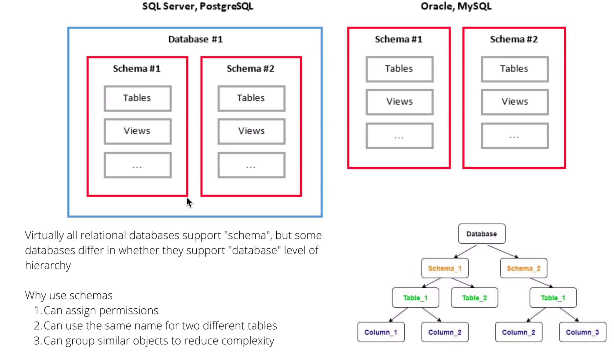

# SQL
### 17SEP21

---

- 100 Class days left. 
    - Pushing to git dialy. 
    - New repository today for SQL; will be making new repositories about once a week
- Grading
    - Pushing every class day to GitHub
    - Weekly, the instructors will look and see if we made pushes every class day
    - Important, measured for accountability

- Starting to write the same type of code we will likely be using every day in DS career
- SQL most common way to access most stored data in the database world

### VOCABULARY

- **Data Stack:** 
    - Most companies are generating their own data.
        - Website
        - App
        - Manual
- **Database:** location of data stored on a disk somewhere; information held there; sometimes used interchangeably with DBMS, but that is the software
- **Client:** Program using to connect to database
    - GUIs common
    - CLIs available also
- **SERVER** computer that runs and stores 
- **Data definition language:** defines the structure of the database
- **Data Manipulation Language:** Language used to insert, update, delete, access information stored in the database - where we will be doing most of the interaction
- **DB Management System:**
- **Types of Data stored in SQL server:**
- **How do we use SQL:**

- Cloud big
    - Amazon
    - Google
    - Azure

## MySQL

- Terminal/Command Line
- GUI
- Main language for most databases
- Couple of other options, but the languages are mostly similar with slight differences

## Table Anatomy

- Similar to Excel 
- **Column Name:**
- **Record:** Single row; all the information about one entry in a table
- **Key:** Unique identifier for each record; each table has a field that must be unique; can be alphanumeric or string, best practice use a number
- **Field:** Columns
- **Value** information in a cell

- Isn't a way to just look at the whole thing like a spreadsheet; no reason to; resource-intensive
- Instead, query specific values  

- **Table Info** more engineering information, gives create syntax
- **Content** Shows first thousand lines of data - gives you an idea of what is being stored
- **Structure:** Provides additional information about the data type in each column as well as extra info about what is and isn't allowed
- **Triggers** get to later
- **Relations** get to later

- Many databases have a number of tables (i.e., employees)
- Some may be hidden

- Sample initial searches
    - `SELECT * FROM mysql.user;` Command + R to execute (Return)
    - `SELECT * FROM mysql.user;`
    - `SELECT user, host FROM mysql.user;`
    - `SELECT * FROM mysql.help_topic;`
    - `SELECT help_topic_id, help_category_id, url FROM mysql.help_topic;`
- Command R executes the line that the cursor is on

## Curriculum Exercises

- Setup new local and remote repository for `database-exercises`
- Save queries as mysql_queries
    - File, save query, pull up dialogue box to save in the appropriate path

- Can execute queries from terminal
    - Results are not user friendly
    - If writing a script that needs info from SQL search, machine-readable from the terminal; But shows why GUI is used. 

## Database v. Schema 

- Often used interchangeably
- Some RDMBs use schema as a second level of organization *within* a database; Separate partitions
- Within MySQL, "database" and "schema" use the same thing and can be used interchangeably
- Words like `SELECT`, `INSERT`, `CREATE` are reserved words in MySQL and cannot be used for database, table, or column names
- Expanded list of [reserved names](https://dev.mysql.com/doc/refman/5.7/en/keywords.html)

-----

## Tables

- Look like a spreadsheet
- Break data down into columns and rows
- DBA / Engineer defines what the columns are named and what kind of data can be contained

### Data Types

- **NUMERIC**
- `INT` Integer. Any nymber *without* a decimal point. 
    - `UNSIGNED` integers can only be positive
- `FLOAT` Number *with* decimal value. Only holds about 7 decimal
    - `DOUBLE` increases precision
- `DECIMAL (length, precision)` Often used for currency. *Precise* decimal number
- `TINYINT [BOOLEAN]`
    -  0 false, 1 true; 
    - -128 to 127 

**TEXT**

- `CHAR(LENGTH)` specified number of characters; will pad
- `VARCHAR(LENGTH)` doesn't pad with extra space
- `TEXT` Can be anything. But slow with big databases. Not used too often.
- `DATE`
- `TIME`
- `DATETIME`
    - Built-in features and functions for comparing different times
- `NULL` behaves like 0; Actually, the absence of a value
    - If there is an optional column rarely used, it can be set up as null

## Creating Tables 

**Generic**

    CREATE TABLE table_name (
    column1_name data_type,
    column2_name data_type,
    ...
    );

**Example**

    CREATE TABLE quotes (
    author_first_name VARCHAR(50),
    author_last_name  VARCHAR(100) NOT NULL,
    content TEXT NOT NULL
    );

Want a primary Key, Quotes above - nothing preventing duplicate values
- Below, how to set it up properly
- Reasonable to let the database server manage your primary key values

    CREATE TABLE quotes (
    id INT UNSIGNED NOT NULL AUTO_INCREMENT,
    author_first_name VARCHAR(50),
    author_last_name  VARCHAR(100) NOT NULL,
    content TEXT NOT NULL,
    PRIMARY KEY (id)
    );

- Common to see the primary key named with the name of the table as well, `quote_id` could work for the primary key name
- Database table names may be singular instead of plural pr written in ALL CAPS

## Relational Database

- Tables related in some way
- Same database
    - Customer Table
    - Agent Table
    - Customers have agents assigned by agent_id_number in the customer table

### Star Schema

- Table comprised of only keys from other tables
- 

## Table commands

>`SHOW TABLES;` Shows tables inside a database
>`DESCRIBE quotes;`

    +-------------------+------------------+------+-----+---------+----------------+
| Field             | Type             | Null | Key | Default | Extra          |
+-------------------+------------------+------+-----+---------+----------------+
| id                | int(10) unsigned | NO   | PRI | NULL    | auto_increment |
| author_first_name | varchar(50)      | YES  |     | NULL    |                |
| author_last_name  | varchar(100)     | NO   |     | NULL    |                |
| content           | text             | NO   |     | NULL    |                |
+-------------------+------------------+------+-----+---------+----------------+
4 rows in set (0.00 sec)

>`SHOW CREATE TABLE quotes;`
    *************************** 1. row ***************************
        Table: quotes
Create Table: CREATE TABLE `quotes` (
    'id' int(10) unsigned NOT NULL AUTO_INCREMENT,
    'author_first_name' varchar(50) DEFAULT NULL,
    'author_last_name' varchar(100) NOT NULL,
    'content' text NOT NULL,
    PRIMARY KEY ('id')
)
1 row in set (0.00 sec)

### Comments
- `-- comment` Double Dash space 

## Basic Statements

- Use `SELECT` statement to **read** data/
- Use `DISTINCT` and `WHERE` clauses to filter
- Understand MySQL operators

---

- So far been looking at the *structure* of databases.
- Now, looking at *data*

- **CRUD* operations: "Create, Read, Update, Delete."
    - Basic building block for working with data in any system
        - Database
        - Web API
        - Cache server

### SQL Quotes

- All strings enclosed in single quote (`'`) SQL standard
    - Some versions of MySQL allow `"` but will stick with single
- To type a single quote in a string use `\'` or two single quotes in a row `''`.

### Comments

- `#` or `--` can preceded single-line comments
- `/* Works for multiple line comments */`

    /*
    Comment
    comment
    still commenting
    */

### Select Statement

Use `SELECT` to find and return rows from a given column or columns.

>`-- The square brackets indicate optional parts of the command.`
>`SELECT column1[, column2[, ...]] FROM table_name;`

To select the fruits and their quantity in our fruits database, we would write.

>`USE fruits_db;`
>
>`SELECT`
>    `name,`
>    `quantity`
>`FROM fruits;`

If we want to retrieve all of the available columns from a database table, we can use the wildcard `*`.

>`SELECT * FROM fruits;`

### Select Distinct statement

Adding the `DISTINCT` keyword to our `SELECT` statement; this will eliminate duplicate values from our output.

>`SELECT DISTINCT column1`
>`FROM table_name;`

- Can only use once

>`SELECT DISTINCT *`
with unique primary key, still gives you everything

If you just want to see a certain number of records you can add.

>`LIMIT n` where n = number of records
>`LIMIT 5`

- SQL doesn't care about lines or spaces or tabs, but format for readability / break things up

- 

### Where Clause

`WHERE` allows you to specify a condition that must be true for a given row to be displayed. The basic syntax looks like:

>`SELECT column1, column2, ...`
>`FROM table_name`
>`WHERE column_name = 'value';`

For example, if we just wanted to view the dragonfruit record, we could write:

>`SELECT * `
>`FROM fruits `
>`WHERE name = 'dragonfruit';`

MySQL string search not case sensitive `Apple` = `apple`

Can use combinations

    `WHERE name = 'apple'
        AND quantity =3;

Also, remember the guaranteed fastest and most precise way to find a single record in a table is to use the table's primary key because it is by nature a unique value:

>`SELECT * `
>`FROM fruits `
>`WHERE id = 5;`

### Operators

| Operator | Description |
|:----------:|-------------|
| `=` | Equal |
| `!=` or `<>` | Not equal |
| `<` | Less than |
| `>` | Greater than |
| `<=` | Less than or equal to |
| `>=` | Greater than or equal to |
| `BETWEEN value1 AND value2` | Greater than or equal to value1 and less than or equal to value2 |

### Miscellaneous Output

Sometimes it may be useful to output arbitrary data from our SQL scripts. We can do this by selecting an arbitrary string and giving it a name like so:

>`SELECT 'I am output!' AS Info;`

>`SELECT 1+1` returns 2
>`SELECT 3=3` return 1 (boolean true)
>`SELECT 2>3` return 0 (boolean false)

### Aliaes

- Aliases allow us to temporarily rename a column, table, or miscellaneous pieces of our query. 
- If the alias name contains spaces, you must enclose the 'alias name' in quotes. 
    - Otherwise, quotes are not needed around your alias_name. 
    - It is fine to use spaces in a column alias, 
    *but it is not good practice to use spaces in a table alias*.

- Using aliases can serve as commenting or remind you why you were doing a particular search

Below is a simple example of using an alias in a `SELECT` statement with the `AS` keyword:

>`SELECT 1 + 1 AS two;`

For example, if we wanted to view the rows in the fruits table where our inventory is low, we might write a query like the following:

    SELECT 
        id,
        name AS low_quantity_fruit,
        quantity AS inventory
    FROM fruits
    WHERE quantity < 4;

