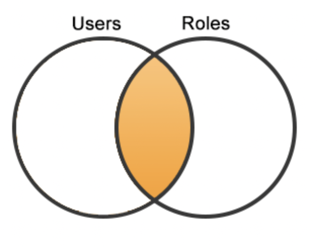
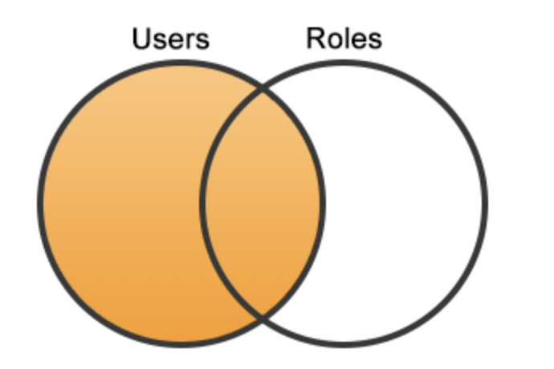
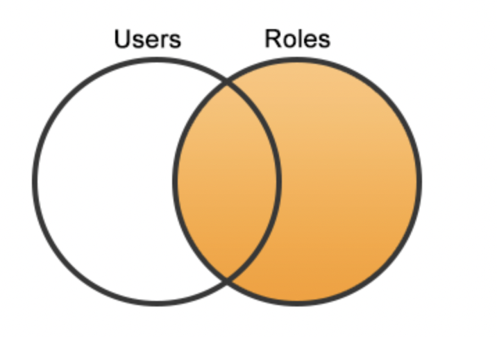

# SQL
### 17SEP21

---

- 100 Class days left. 
    - Pushing to git dialy. 
    - New repository today for SQL; will be making new repositories about once a week
- Grading
    - Pushing every class day to GitHub
    - Weekly, the instructors will look and see if we made pushes every class day
    - Important, measured for accountability

- Starting to write the same type of code we will likely be using every day in DS career
- SQL most common way to access most stored data in the database world

### VOCABULARY

- **Data Stack:** 
    - Most companies are generating their own data.
        - Website
        - App
        - Manual
- **Database:** location of data stored on a disk somewhere; information held there; sometimes used interchangeably with DBMS, but that is the software
- **Client:** Program using to connect to database
    - GUIs common
    - CLIs available also
- **SERVER** computer that runs and stores 
- **Data definition language:** defines the structure of the database
- **Data Manipulation Language:** Language used to insert, update, delete, access information stored in the database - where we will be doing most of the interaction
- **DB Management System:**
- **Types of Data stored in SQL server:**
- **How do we use SQL:**

- Cloud big
    - Amazon
    - Google
    - Azure

## MySQL

- Terminal/Command Line
- GUI
- Main language for most databases
- Couple of other options, but the languages are mostly similar with slight differences

## Table Anatomy

- Similar to Excel 
- **Column Name:**
- **Record:** Single row; all the information about one entry in a table
- **Key:** Unique identifier for each record; each table has a field that must be unique; can be alphanumeric or string, best practice use a number
- **Field:** Columns
- **Value** information in a cell

- Isn't a way to just look at the whole thing like a spreadsheet; no reason to; resource-intensive
- Instead, query specific values  

- **Table Info** more engineering information, gives create syntax
- **Content** Shows first thousand lines of data - gives you an idea of what is being stored
- **Structure:** Provides additional information about the data type in each column as well as extra info about what is and isn't allowed
- **Triggers** get to later
- **Relations** get to later

- Many databases have a number of tables (i.e., employees)
- Some may be hidden

- Sample initial searches
    - `SELECT * FROM mysql.user;` Command + R to execute (Return)
    - `SELECT * FROM mysql.user;`
    - `SELECT user, host FROM mysql.user;`
    - `SELECT * FROM mysql.help_topic;`
    - `SELECT help_topic_id, help_category_id, url FROM mysql.help_topic;`
- Command R executes the line that the cursor is on

## Curriculum Exercises

- Setup new local and remote repository for `database-exercises`
- Save queries as mysql_queries
    - File, save query, pull up dialogue box to save in the appropriate path

- Can execute queries from terminal
    - Results are not user friendly
    - If writing a script that needs info from SQL search, machine-readable from the terminal; But shows why GUI is used. 

## Database v. Schema 

- Often used interchangeably
- Some RDMBs use schema as a second level of organization *within* a database; Separate partitions
- Within MySQL, "database" and "schema" use the same thing and can be used interchangeably
- Words like `SELECT`, `INSERT`, `CREATE` are reserved words in MySQL and cannot be used for database, table, or column names
- Expanded list of [reserved names](https://dev.mysql.com/doc/refman/5.7/en/keywords.html)

-----

## Tables

- Look like a spreadsheet
- Break data down into columns and rows
- DBA / Engineer defines what the columns are named and what kind of data can be contained

### Data Types

- **NUMERIC**
- `INT` Integer. Any nymber *without* a decimal point. 
    - `UNSIGNED` integers can only be positive
- `FLOAT` Number *with* decimal value. Only holds about 7 decimal
    - `DOUBLE` increases precision
- `DECIMAL (length, precision)` Often used for currency. *Precise* decimal number
- `TINYINT [BOOLEAN]`
    -  0 false, 1 true; 
    - -128 to 127 

**TEXT**

- `CHAR(LENGTH)` specified number of characters; will pad
- `VARCHAR(LENGTH)` doesn't pad with extra space
- `TEXT` Can be anything. But slow with big databases. Not used too often.
- `DATE`
- `TIME`
- `DATETIME`
    - Built-in features and functions for comparing different times
- `NULL` behaves like 0; Actually, the absence of a value
    - If there is an optional column rarely used, it can be set up as null

## Creating Tables 

**Generic**

    CREATE TABLE table_name (
    column1_name data_type,
    column2_name data_type,
    ...
    );

**Example**

    CREATE TABLE quotes (
    author_first_name VARCHAR(50),
    author_last_name  VARCHAR(100) NOT NULL,
    content TEXT NOT NULL
    );

Want a primary Key, Quotes above - nothing preventing duplicate values
- Below, how to set it up properly
- Reasonable to let the database server manage your primary key values

    CREATE TABLE quotes (
    id INT UNSIGNED NOT NULL AUTO_INCREMENT,
    author_first_name VARCHAR(50),
    author_last_name  VARCHAR(100) NOT NULL,
    content TEXT NOT NULL,
    PRIMARY KEY (id)
    );

- Common to see the primary key named with the name of the table as well, `quote_id` could work for the primary key name
- Database table names may be singular instead of plural pr written in ALL CAPS

## Relational Database

- Tables related in some way
- Same database
    - Customer Table
    - Agent Table
    - Customers have agents assigned by agent_id_number in the customer table

### Star Schema

- Table comprised of only keys from other tables
- 

## Table commands

>`SHOW TABLES;` Shows tables inside a database
>`DESCRIBE quotes;`

    +-------------------+------------------+------+-----+---------+----------------+
| Field             | Type             | Null | Key | Default | Extra          |
+-------------------+------------------+------+-----+---------+----------------+
| id                | int(10) unsigned | NO   | PRI | NULL    | auto_increment |
| author_first_name | varchar(50)      | YES  |     | NULL    |                |
| author_last_name  | varchar(100)     | NO   |     | NULL    |                |
| content           | text             | NO   |     | NULL    |                |
+-------------------+------------------+------+-----+---------+----------------+
4 rows in set (0.00 sec)

>`SHOW CREATE TABLE quotes;`
    *************************** 1. row ***************************
        Table: quotes
Create Table: CREATE TABLE `quotes` (
    'id' int(10) unsigned NOT NULL AUTO_INCREMENT,
    'author_first_name' varchar(50) DEFAULT NULL,
    'author_last_name' varchar(100) NOT NULL,
    'content' text NOT NULL,
    PRIMARY KEY ('id')
)
1 row in set (0.00 sec)

### Comments
- `-- comment` Double Dash space 

## Basic Statements

- Use `SELECT` statement to **read** data/
- Use `DISTINCT` and `WHERE` clauses to filter
- Understand MySQL operators

---

- So far been looking at the *structure* of databases.
- Now, looking at *data*

- **CRUD* operations: "Create, Read, Update, Delete."
    - Basic building block for working with data in any system
        - Database
        - Web API
        - Cache server

### SQL Quotes

- All strings enclosed in single quote (`'`) SQL standard
    - Some versions of MySQL allow `"` but will stick with single
- To type a single quote in a string use `\'` or two single quotes in a row `''`.

### Comments

- `#` or `--` can preceded single-line comments
- `/* Works for multiple line comments */`

    /*
    Comment
    comment
    still commenting
    */

### Select Statement

Use `SELECT` to find and return rows from a given column or columns.

>`-- The square brackets indicate optional parts of the command.`
>`SELECT column1[, column2[, ...]] FROM table_name;`

To select the fruits and their quantity in our fruits database, we would write.

>`USE fruits_db;`
>
>`SELECT`
>    `name,`
>    `quantity`
>`FROM fruits;`

If we want to retrieve all of the available columns from a database table, we can use the wildcard `*`.

>`SELECT * FROM fruits;`

### Select Distinct statement

Adding the `DISTINCT` keyword to our `SELECT` statement; this will eliminate duplicate values from our output.

>`SELECT DISTINCT column1`
>`FROM table_name;`

- Can only use once

>`SELECT DISTINCT *`
with unique primary key, still gives you everything

If you just want to see a certain number of records you can add.

>`LIMIT n` where n = number of records
>`LIMIT 5`

- SQL doesn't care about lines or spaces or tabs, but format for readability / break things up

- 

### Where Clause

`WHERE` allows you to specify a condition that must be true for a given row to be displayed. The basic syntax looks like:

>`SELECT column1, column2, ...`
>`FROM table_name`
>`WHERE column_name = 'value';`

For example, if we just wanted to view the dragonfruit record, we could write:

>`SELECT * `
>`FROM fruits `
>`WHERE name = 'dragonfruit';`

MySQL string search not case sensitive `Apple` = `apple`

Can use combinations

    `WHERE name = 'apple'
        AND quantity =3;

Also, remember the guaranteed fastest and most precise way to find a single record in a table is to use the table's primary key because it is by nature a unique value:

>`SELECT * `
>`FROM fruits `
>`WHERE id = 5;`

### Operators

| Operator | Description |
|:----------:|-------------|
| `=` | Equal |
| `!=` or `<>` | Not equal |
| `<` | Less than |
| `>` | Greater than |
| `<=` | Less than or equal to |
| `>=` | Greater than or equal to |
| `BETWEEN value1 AND value2` | Greater than or equal to value1 and less than or equal to value2 |

### Miscellaneous Output

Sometimes it may be useful to output arbitrary data from our SQL scripts. We can do this by selecting an arbitrary string and giving it a name like so:

>`SELECT 'I am output!' AS Info;`

>`SELECT 1+1` returns 2
>`SELECT 3=3` return 1 (boolean true)
>`SELECT 2>3` return 0 (boolean false)

### Aliaes

- Aliases allow us to temporarily rename a column, table, or miscellaneous pieces of our query. 
- If the alias name contains spaces, you must enclose the 'alias name' in quotes. 
    - Otherwise, quotes are not needed around your alias_name. 
    - It is fine to use spaces in a column alias, 
    *but it is not good practice to use spaces in a table alias*.

- Using aliases can serve as commenting or remind you why you were doing a particular search

Below is a simple example of using an alias in a `SELECT` statement with the `AS` keyword:

>`SELECT 1 + 1 AS two;`

For example, if we wanted to view the rows in the fruits table where our inventory is low, we might write a query like the following:

    SELECT 
        id,
        name AS low_quantity_fruit,
        quantity AS inventory
    FROM fruits
    WHERE quantity < 4;

-----
## 20SEP21

## Clauses

### Where

The WHERE clause, if given, indicates the condition or conditions that rows must satisfy to be selected. The `WHERE` condition is an expression that evaluates to true for each row to be selected. The statement selects all rows if there is no `WHERE` clause.

>SELECT * FROM  employees WHERE hire_date = '1985-01-01'

We can use `WHERE` with the `LIKE` option to find similarities. The % are wildcards.

This query will select all first names with the letters combination 'sus':

    SELECT first_name
    FROM employees
    WHERE first_name LIKE '%sus%';

While not a part of the `WHERE` clause, it is worth mentioning that we can add the `DISTINCT` keyword to our `SELECT` statement to only get non-repeating values.

    SELECT DISTINCT first_name
    FROM employees
    WHERE first_name LIKE '%sus%';

We can use `WHERE` with `BETWEEN` to find specific ranges of values.
To find all the employees between employee number 10026 and 10082:

    SELECT emp_no, first_name, last_name
    FROM employees
    WHERE emp_no BETWEEN 10026 AND 10082;

We can use `WHERE` with `IN` to query only very specific sets of values. The () are required when you use `IN`.

To find all the employees with the last name of 'Herber', 'Dredge', 'Lipner', and 'Baek':

    SELECT emp_no, first_name, last_name
    FROM employees
    WHERE last_name IN ('Herber', 'Dredge', 'Lipner', 'Baek');

We can also use comparison operators.

    SELECT emp_no, first_name, last_name
    FROM employees
    WHERE last_name = 'Baek';

    SELECT emp_no, first_name, last_name
    FROM employees
    WHERE emp_no < 10026;

    SELECT emp_no, first_name, last_name
    FROM employees
    WHERE emp_no <= 10026;

We can also use `IS NULL` and `IS NOT NULL` to see if a value is `NULL` or not.

    SELECT emp_no, title
    FROM titles
    WHERE to_date IS NOT NULL;

## Chaining WHERE clauses

We can chain together an `IN` clause with a `LIKE` clause, or any of the clauses, using `AND` and `OR`.

    SELECT emp_no, first_name, last_name
    FROM employees
    WHERE last_name IN ('Herber','Baek')
        AND emp_no < 20000;

The important thing is that we can chain as many of these as we please together, but it can get messy very quickly.

    SELECT emp_no, first_name, last_name
    FROM employees
    WHERE emp_no < 20000
        AND last_name IN ('Herber','Baek')
        OR first_name = 'Shridhar';

We can force evaluation grouping using ().

    SELECT emp_no, first_name, last_name
    FROM employees
    WHERE emp_no < 20000
        AND (
            last_name IN ('Herber','Baek')
        OR first_name = 'Shridhar'
    );

### Further Reading

- [MySQL Expression Syntax](https://dev.mysql.com/doc/refman/5.7/en/expressions.html)

## Order By

Queries with a ORDER BY clause normally follow this form:

    SELECT column FROM table ORDER BY column_name [ASC|DESC];

Columns selected for output can be referred to in ORDER BY and GROUP BY clauses using column names, column aliases, or column positions. Column positions are integers and begin with 1.

    SELECT first_name, last_name
    FROM employees
    ORDER BY last_name;

To sort in reverse order, add the DESC (descending) keyword to the name of the column in the ORDER BY clause that you are sorting by.

    SELECT first_name, last_name
    FROM employees
    ORDER BY last_name DESC;

The default is ascending order; this can be specified explicitly using the ASC keyword.

    SELECT first_name, last_name
    FROM employees
    ORDER BY last_name ASC;

### Chaining `ORDER BY` Clauses

The ORDER BY clause also allows you to chain together column names, column aliases, or column positions.

    SELECT first_name, last_name
    FROM employees
    ORDER BY last_name DESC, first_name ASC;

### Exercise

## LIMIT

Get query results using `LIMIT` clause

Generally, a query with a LIMIT clause follows this form:

    SELECT columns FROM table LIMIT count [OFFSET count];

The simplest use of the `LIMIT` clause just specifies a number after the keyword.

    SELECT emp_no, first_name, last_name
    FROM employees
    WHERE first_name LIKE 'M%'
    LIMIT 10;

Adding an `OFFSET` tells MySQL which row to start with.

    SELECT emp_no, first_name, last_name
    FROM employees
    WHERE first_name LIKE 'M%'
    LIMIT 25 OFFSET 50;

`LIMIT` and `OFFSET` are commonly used for pagination, or creating pages of data.

The above query asks for the employee number, first name, and last name, where the first name starts with an 'M'. The results are offset by fifty and will start at the fifty-first record, limiting the results to twenty-five records.

### Exercises

-----

21SEP21 **TODAY:** SQL Functions + group by = keys to the castle of data

## Functions

- Compute or do things; Operate on data in tables.

[Functions and Operators](https://dev.mysql.com/doc/refman/5.7/en/functions.html)

[String Functions](https://dev.mysql.com/doc/refman/5.7/en/string-functions.html#function_concat)

### CONCAT

- The `CONCAT()` function takes in any number of strings or column names and will concatenate them all together.
- Separate stings with commas

>`SELECT CONCAT('Hello ', 'Codeup', '!');`

Make a combined name as alias
    USE employees;
    SELECT CONCAT(first_name, " ", last_name) AS full_name
    FROM employees
    LIMIT 10;

### Like / Not Like

Use in `WHERE` queries with `%` as wildcard

### SUBSTR

We can extract part of a string with the `SUBSTR` function.

>`SUBSTR(string, start_index, length)`

We need to supply the string we wish to manipulate, the starting index, i.e., which character to start from, and the length, or the number of characters to extract.

>`SELECT SUBSTR('abcdefg', 2, 4);`
    bcde

**String Indexes in MySQL** *In MySQL, the first character in a string is at index 1. This is notably different from other programming languages, like Python, where indexes start from 0.*

### Case Conversion 

We can use the `UPPER` and `LOWER` functions to convert to upper or lower case.

>`SELECT UPPER('abcde'), LOWER('ABCDE');`

### Replace

The `REPLACE` function lets us manipulate strings by replacing substrings. The general form looks like this:

>`REPLACE(subject, search, replacement)`

>`SELECT REPLACE('abcdefg', 'abc', '123');`
123defg

## Date and Time Functions

MySQL offers a wide range of [date and time functions](https://dev.mysql.com/doc/refman/5.7/en/date-and-time-functions.html). 

One of the most commonly used is `NOW()` or its synonymous alias `CURRENT_TIMESTAMP()`.

### NOW

The `NOW()` function returns the current time in `YYYY-MM-DD HH:MM:SS` format.

>`SELECT NOW();`

### CURDATE

The `CURDATE()` function returns just the current date with no time information in `YYYY-MM-DD` format.

>`SELECT CURDATE();`

### CURTIME

The function `CURTIME()` returns the time formatted as `HH:MM:SS`.

>`SELECT CURTIME();`

### UNIX_TIMESTAMP() & UNIX_TIMESTAMP(date)

The `UNIX_TIMESTAMP()` function is used to represent time as an integer. 

It will return the number of seconds since midnight January 1st, 1970. 

Time is a sticky problem. Dates for daylight savings change - some states do and don't observe. Timezones. Saudi Arabia changing calendars. Need a source of universal truth about time. 

If you pass a date time value to `UNIX_TIMESTAMP()`, it will give you the number of seconds from the unix epoch to that date.

    SELECT CONCAT(
        'Teaching people to code for ',
        UNIX_TIMESTAMP() - UNIX_TIMESTAMP('2014-02-04'),
        ' seconds'
    );

## Numerical Functions

MySQL provides a handful of functions for common mathematical operations on sequences. Some of the most common are:

>`AVG:` the mean

>`MIN:` for finding the minimum value

>`MAX:` for finding the maximum value

>`SELECT MIN(emp_no) from employees;`

>`SELECT * from salaries;`
>`SELECT AVG(salary) from salaries;`
>`SELECT MAX(salary) from salaries;`
>`SELECT MAX(salary)-MIN(salary) AS range FROM salaries;` 

We will use these functions more in the next lesson when we introduce `GROUP BY`.

### Casting

While not technically a function call, casting is a related concept. 

Casting lets us convert one type to another. 

For the most part, we can simply treat a number as a string, or a string as a number, and MySQL will figure out what to do:

    SELECT
        1 + '4',
        '3' - 1,
        CONCAT('Here is a number: ', 123);

There is also an explicit `CAST` function should the need arise:

    SELECT
        CAST(123 as CHAR),
        CAST('123' as UNSIGNED);

### Further Reading

[List of MySQL Mathematical Functions](https://dev.mysql.com/doc/refman/5.7/en/mathematical-functions.html)

[MySQL Regular Expression Syntax](https://dev.mysql.com/doc/refman/5.7/en/regexp.html#regexp-syntax)

### Exercises

## Group By

Grouping results based on data in columns allows us to remove duplicates, much like using `DISTINCT`. We can also use `GROUP BY` in combination with *aggregate functions*.

### Using the GROUP BY Clause

We can also use multiple columns:

***Group by no longer works like order by in SQL 8; Disregard some curriculum instructions***

    SELECT last_name, first_name
    FROM employees
    GROUP BY last_name, first_name;

`select * from employees where first_name = 'Georgi';` --253

    SELECT first_name
    FROM employees
    GROUP BY first_name;

    SELECT count(*) from employees where firrst_name = 'Georgi'

    SELECT first_name, count(first_name)
    FROM employees
    group by first_name;

    SELECT *
        FROM titles
        GROUP BY title;
    
    breaks * - need to select and group by the same thing

    SELECT title
        FROM titles
        GROUP By

If you see "group by" think "for each" title to make a row
For each title, show the count

    SELECT title, count(title)
        FROM titles
        GROUP BY title;

    -- What's the average salary of each department?
    SELECT dept_no, avg(salary), min(salary), max(salary)
        FROM salaries
    JOIN dept_emp USING(emp_no)
    GROUP BY dept_no;

Once grouped by. can add aggregate function which acts on each group.

    SELECT AVG(salary)
    
    --WHats the historic average salary?
     SELECT dept_no, avg(salary), min(salary), max(salary)
        FROM salaries
    JOIN dept_emp USING(emp_no)
    WHERE salaries.to_date > curdate()
    GROUP BY dept_no;

    -- Show the nmber of duplocate fist names, but only show duplicates less than 200

`HAVING` is like a `WHERE` clause for groupby

    SELECT fitst_name, count(first_name) AS count_first_names
    FROM employees
    GROUP BY first_name
    HAVING count_first_names < 200;

Can use where before group by and in conjunction with hagin 

    SELECT fitst_name, count(first_name) AS count_first_names
    FROM employees
    WHERE birth_date LIKE '%-12-25'
    AND gender = 'F'
    GROUP BY first_name
    HAVING count_first_names < 200;

Aliases work kind of like vairables - renaming

    SELECT first_name, count(first_name) AS count_first_names
    FROM employees
    GROUP BY first_name
    HAVING count_first_namesbetween 247 and 275

can still ads wheres before

---
22SEP21

## Relationships

The R in RDBMS stands for **R**elational. MySQL offers us a lot of power through its ability to relate data from different tables.

In this section we will learn about how to use SQL to manage data across several tables.

## Indexes (Indices)

Indexes, also referred to as indices, are used to optimize queries and ensure integrity of data.

>Indexes are used to find rows with specific column values quickly. Without an index, MySQL must begin with the first row and then read through the entire table to find the relevant rows. The larger the table, the more this costs. If the table has an index for the columns in question, MySQL can quickly determine the position to seek to in the middle of the data file without having to look at all the data. If a table has 1,000 rows, this is at least 100 times faster than reading sequentially. If you need to access most of the rows, it is faster to read sequentially, because this minimizes disk seeks.` 

[MySQL Index documentation](https://dev.mysql.com/doc/refman/5.0/en/mysql-indexes.html)

### Using Indexes

We use indexes on almost every table we create. At the very least, we are going to set a primary key, or a unique identifier for each row, much like a row number in a spreadsheet. This will give us the ability to easily reference the data in that row, and MySQL will make sure there are never duplicates.

### Primary Keys

The primary key for a table represents the column or set of columns that you use in your most vital queries. It has an associated index, for fast query performance. Query performance benefits from the NOT NULL optimization, because it cannot include any NULL values. 

[MySQL Primary Key Documentation](https://dev.mysql.com/doc/refman/5.7/en/optimizing-primary-keys.html)

Typically we add the `PRIMARY KEY` index on our id column, along with `AUTO_INCREMENT`.

An example we used earlier to create the quotes table included a `PRIMARY KEY` index.

    CREATE TABLE quotes (
        id INT NOT NULL AUTO_INCREMENT,
        author VARCHAR(50) NOT NULL,
        content VARCHAR(240) NOT NULL,
        PRIMARY KEY (id)
    );

This table will now have a column named id that will increase automatically, starting at 1. Because we set it as a primary key, the id column will never have a duplicate, and performing queries on the id will be very fast.

### Unique

Optimization is the primary focus of indexes; however, we can use indexes to ensure uniqueness and create relationships.

`UNIQUE` indexes work very similar to primary keys; however, unique indexes are not limited to 1 per table. If we need to add a constraint on a column to make sure there are not duplicates, like email addresses in a user database, then the `UNIQUE` constraint can be added to the column.

In our quotes table, we may want to make sure each quote is unique, so we don't end up with duplicate quotes.

We can use the `ALTER` statement to update a table.

    ALTER TABLE quotes
    ADD UNIQUE (content);

    SELECT * FROM salaries;

Employee number not unique therefore not employee key
Is the primary key for employees, but not for salary key `FOREIGN KEY` primary key for a different table

    DESCRIBE salaries

`COMPOSITE KEY` defined by two columns - `FROM` date combined with `empl_id` makes for a unique identifier.

`SHOW create table salaries;`

### Multiple-Column Indexes

MySQL can create composite indexes (that is, indexes on multiple columns). An index may consist of up to 16 columns. 

[MySQL multiple column indexes](https://dev.mysql.com/doc/refman/5.7/en/multiple-column-indexes.html)

In our quotes table, we want to keep another table that is just authors. This table will contain an id and the author's first name and last name. We want the combination of the author's first and last name to be unique.

We can create this table with the following query:

    CREATE TABLE authors (
        id INT NOT NULL AUTO_INCREMENT,
        first_name VARCHAR(100) NOT NULL,
        last_name VARCHAR(100) NOT NULL,
        PRIMARY KEY (id),
        UNIQUE (first_name, last_name)
    );

### Exercises

1. USE your employees database.

2. `DESCRIBE` each table and inspect the keys and see which columns have indexes and keys.

3. `SHOW CREATE table_name` for each table

------

## JOIN

### Lesson Goals

- Understand what it means to join tables
- Understand the difference between a left and right join
- Understand how to join multiple tables to a query

MySQL allows us to `JOIN` tables, usually based on a foreign key relationship. The process of joining will allow us to obtain query results from more than one table in a single query. There are different types of joins, and those different types give us a lot of flexibility in the actual query results. We will be discussing the following types of joins:
    - `JOIN`, a.k.a `INNER JOIN`
    - `LEFT JOIN`
    - `RIGHT JOIN`

### Relationship Types

Before we discuss the specifics of how to join tables together, we should have a conceptual background of the different types of relationships. The most common relationships we will encounter are:
- **one to many:** a relationship where many different rows on one table are associated with a single row on another table
    - looking at this relationship from the other direction is a many to one relationship
    - i.e, one employee may have many salaries
- **many to many:** many different rows on one table are related to many different roles on another table.
    - Emplyee may have worked for many departments, and a departmant can have many different employees.

*Keep these relationship types in mind as we learn how to write to SQL to realize these relationships.*

### Join Syntax

The syntax for joining tables is simply using `JOIN` to describe the table that will be joining the query, and `ON` to describe the relationship.

    SELECT columns
    FROM table_a as A -- Dont need alias
    JOIN table_b as B ON A.id = B.fk_id;

In the example above, the query will obtain a result based on two tables: `table_a` and `table_b`. Notice that tables can be aliased by using `table_name` as `alias`. The records from `table_a` and `table_b` will be joined based on the relationship provided between the `column id` in `table_a` and the `column fk_id` in `table_b`.

It is also helpful to know that the first table mentioned, `table_a` in the above example, is referred to as the *left* table of the `join`. The joined/second table mentioned, `table_b` in the above example, is referred to as the right table of the join.

### Join Example DB

In order to properly describe the different types of joins, we need a suitable data set. Let us assume that the following tables and associated data are put into a database named `join_test_db`

    CREATE TABLE roles (
        id INT UNSIGNED NOT NULL AUTO_INCREMENT,
        name VARCHAR(100) NOT NULL,
        PRIMARY KEY (id)
    );

    CREATE TABLE users (
        id INT UNSIGNED NOT NULL AUTO_INCREMENT,
        name VARCHAR(100) NOT NULL,
        email VARCHAR(100) NOT NULL,
        role_id INT UNSIGNED DEFAULT NULL,
        PRIMARY KEY (id),
        FOREIGN KEY (role_id) REFERENCES roles (id)
    );

    INSERT INTO roles (name) VALUES ('admin');
    INSERT INTO roles (name) VALUES ('author');
    INSERT INTO roles (name) VALUES ('reviewer');
    INSERT INTO roles (name) VALUES ('commenter');

    INSERT INTO users (name, email, role_id) VALUES
    ('bob', 'bob@example.com', 1),
    ('joe', 'joe@example.com', 2),
    ('sally', 'sally@example.com', 3),
    ('adam', 'adam@example.com', 3),
    ('jane', 'jane@example.com', null),
    ('mike', 'mike@example.com', null);

    seect *
    from employees
    join salaries using(emp_no);

`using` eliminates duplication of same key

### Join / Inner Join

We will first discuss the basic `join`, also referred to as `inner join`. Here is an example of a `join` query on the above data set:

    SELECT users.name as user_name, roles.name as role_name
    FROM users
    JOIN roles ON users.role_id = roles.id;

The example above performs a basic join (note that join can be replaced with inner join for the same result) between the `users` table and `roles` table based on the relationship between the `role_id` in the users table and the `id` in the `roles` table.

For a basic join, we can expect that we will get only the results where both the left and right tables have values for their respective keys that are mentioned in the `ON` part of the query. Here is a diagram explaining the expected results:

We know that there are four roles and six users in our database. However, there are only four results that have a corresponding record in both the left and right tables of the join. 

### Left Join

Another commonly used type of join is the `left join`. A `left join` is used when you want to retrieve all the records from the left table, regardless of whether or not they have a corresponding record in the right table. Here is an example of a `left join` query on the above data set:

    SELECT users.name AS user_name, roles.name AS role_name
    FROM users
    LEFT JOIN roles ON users.role_id = roles.id;

Note that the only difference between this query and the previous query is the we have added the word `left` in front of `join` to get a `left join`. Here is a diagram explaining the expected results:

Since we know that there are six users in the database, and `users` is the left table of the query, we will get all the users returned regardless of whether or not they have a role. Here is the actual query result:

### Right Join

Another type of join is the `right join`. This one is not as common as the other types we have discussed. A `right join` is used when you want to retrieve all the records from the right table, regardless of whether or not they have a corresponding record in the left table. The reason that `right join` is not used as often is because a right join can be rewritten as a `left join` by changing the order of the tables in the query. Here is an example of a right join query on the above data set:

    SELECT users.name AS user_name, roles.name AS role_name
    FROM users
    RIGHT JOIN roles ON users.role_id = roles.id;

Note that the only difference between this query and the previous query is the we have replaced the word `left` with `right` to make a `right join`. Here is a diagram explaining the expected results:

Since we know that there are four roles in the database, and roles is the right table of the query, we will get all the roles returned regardless of whether or not there is a user that has that role. 

Here is the above `right join` query rewritten as a `left join`:

    SELECT users.name as user_name, roles.name as role_name
    FROM roles
    LEFT JOIN users ON users.role_id = roles.id;

Notice that the only changes are that we are not using a `left` join, and the order of the tables was swapped.

### Associative Tables and Joins

Sometimes we need to use multiple joins across a table that associates two other tables with one another. In the `employees` database we have been using, multiple joins would be required to get an employee name along with the name of the department they work for.

Employees and departments are mapped through an associative table named `dept_emp`. The `dept_emp` table contains foreign keys to both the `employees` and `departments` tables. It also contains a `from_date` and `to_date` which allows for employees to be associated with different departments over time. This type of relationships is referred to as a many-to-many association. When an employee is currently active with a particular department, the to_date is set to `9999-01-01`. This information will be needed for our query.

Let us try to find the full name and department for the employee with an employee id of `10001`:

    SELECT CONCAT(e.first_name, ' ', e.last_name) AS full_name, d.dept_name
    FROM employees AS e
    JOIN dept_emp AS de
        ON de.emp_no = e.emp_no
    JOIN departments AS d
        ON d.dept_no = de.dept_no
    WHERE de.to_d`ate = '9999-01-01' AND e.emp_no = 10001;

As you can see, we start out with the `employees` table. We then join the `employees` table with the `dept_emp` table on the `emp_no` relationship. Next, we join the `departments` table on the `dept_no` relationship. This bridges the gap between the employee and the department they work in. Notice that we also add the where condition with the `to_date` and the `emp_no` so we only get the active department for the employee we are looking for.

### Joining three tables

    USE employees;

    select * from departments;
    select * from employees;
    select * from dept_emp;

    select * 
    from employees
    join dept_emp on employees.emp_no = dept_emp.emp_no
    join departments on departments.dept_no = dept_emp.dept_no;

-- Same result, but "using(column_name)" since dept_no is the same on both tables and emp_no same on both tables

    USE employees;

    select * from departments;
    select * from employees;
    select * from dept_emp;

    select * 
    from employees
    join dept_emp using (emp_no)
    join departments using(dept_no);

Can tack on all other tools
    
    WHERE to_date > curdate(); -- current employees

    ORDER BY

    GROUP BY

All the SQL clauses, functions, other building blocks can be used

    AND dept_name = "Customer Service"
    AND birth_date like '%-09-22'

Can build anything together as long as syntactically correct

*Programs are buildings of thought* each piece of syntax is a thought that can be combined

    
## We typically write SQL clauses in this order

