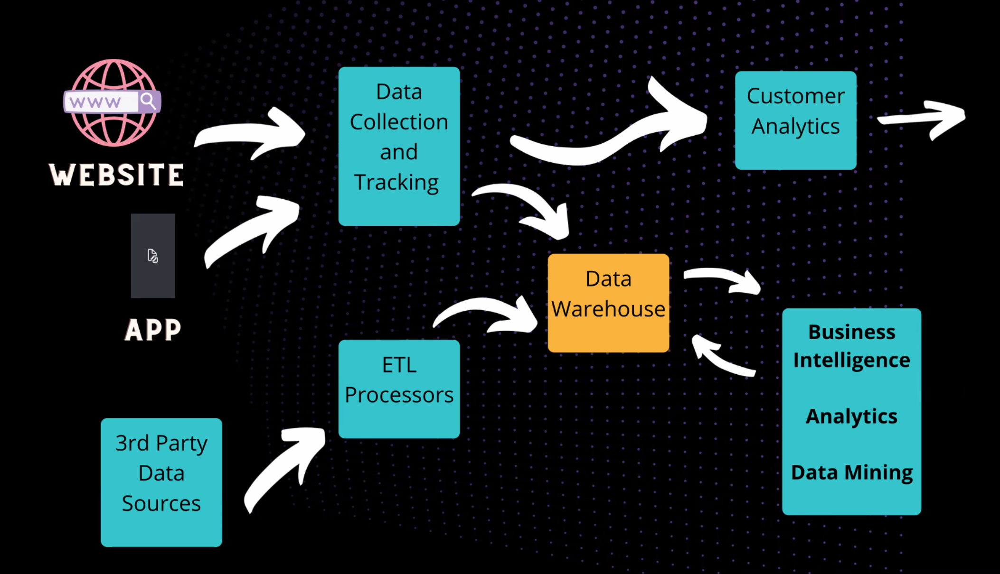

# SQL
### 17SEP21

---

- 100 Class days left. 
    - Pushing to git dialy. 
    - New repository today for SQL; will be making new repositories about once a week
- Grading
    - Pushing every clas day to github
    - Weekly, will look and see if pushes were made every class day
    - Important, measured for accountability

- Starting to write the same type of code we will likely be using every day in DS career
- SQL most common way to access most stored data in the database world

### VOCABULARY

- **Data Stack:** 
    - Most companies are generating their own data.
        - Website
        - App
        - Manual
- **Database:**
- **DB Management System:**
- **Types of Data stored in SQL server:**
- **How do we use SQL:**
- *****

